# OpenAgent Harness 面试速学材料：从低理解到能答

这份材料专门给“我现在还没完全吃透项目”的状态用。目标是让你能在面试里讲清楚 Harness 的故事、数据流、代码模块、证据和边界。先记住：Harness 是 OpenAgent 的执行面，Platform Backend 是控制面。

## 0. 先背这一版

30 秒版：

> OpenAgent Harness 是一个面向 Coding Agent 的本地执行与评测框架。它读取 `task.json`，创建隔离 workspace，构造仓库上下文，让模型按 JSON action 调用 read/search/inspect/edit/test 等工具，在 allowlist 权限内生成 patch，运行 acceptance 测试，并输出 `patch.diff`、`test_result.json`、`gate.json`、`scorecard.json`、`trace.jsonl`、`trace.sqlite` 和 `report.html`。它重点不是“模型会写代码”，而是让 Agent 修改过程可复现、可审计、可比较。

一句防虚边界：

> 这是面试级、本地可运行的 Coding Agent harness，不是商业级 Agent 平台；benchmark 里有 scripted baseline 用于零成本稳定演示，真实 API 模式需要本地 key 和显式 `--allow-llm-calls`。

一句技术核心：

> 核心闭环是 `TaskSpec -> Workspace -> ContextBuilder/CodeIndex -> JSON Action Agent -> LocalToolRegistry -> PermissionPolicy -> Acceptance -> QualityGate -> Scorecard/Trace/Report`。

## 1. 这个项目到底解决什么问题

普通 LLM 写代码 demo 的问题是：它可能生成一段看起来对的代码，但工程上没人知道：

- 它到底读了哪些文件？
- 它有没有改不该改的文件？
- 它有没有直接改测试来骗通过？
- 它有没有真的跑测试？
- patch 大不大，review 成本高不高？
- 失败时是没 patch、测试失败、越权、超时，还是没报告？
- 面试官能不能看到证据？

OpenAgent Harness 的回答是：把一次 Coding Agent 修改变成一个可检查的 run。

一个 run 至少留下：

- `repo/`：隔离后的仓库副本。
- `patch.diff`：真实 diff。
- `test_result.json`：测试命令、stdout/stderr、退出码、耗时。
- `gate.json`：是否通过 quality gate。
- `scorecard.json`：分数、patch 行数、改动文件数、失败类型。
- `trace.jsonl` / `trace.sqlite`：可回放事件线。
- `final_report.md` / `report.html`：给人看的报告。

## 2. 一次 run 的完整流程

```mermaid
flowchart LR
    T["task.json<br/>repo / goal / allowlist / acceptance / budget"] --> W["WorkspaceManager<br/>隔离 repo 副本"]
    W --> C["ContextBuilder + CodeIndex<br/>仓库地图 / AST 符号 / 候选文件"]
    C --> A["JsonActionCodingAgent<br/>model 输出 JSON action"]
    A --> R["LocalToolRegistry<br/>read/search/inspect/edit/run"]
    R --> P["PermissionPolicy<br/>allowlist / shell safety"]
    P --> V["Acceptance Runner<br/>pytest / lint / command"]
    V --> G["QualityGate<br/>diff / tests / scope / report"]
    G --> S["Scorecard + Trace + HTML Report"]
```



面试解释：

> 任务从 `task.json` 开始。Harness 先复制一个隔离 workspace，不直接污染原仓库。然后用 ContextBuilder 和 CodeIndex 给模型紧凑上下文。模型不能随便执行命令，只能输出 JSON action，由 LocalToolRegistry 执行。写文件和 shell 命令都经过 PermissionPolicy。最后跑 acceptance，生成 diff、测试结果、gate、scorecard、trace 和 report。

## 3. 代码地图

| 文件 | 你要会说什么 |
|---|---|
| `src/openagent_harness/schema.py` | `TaskSpec`、`TraceEvent`、`GateResult`、`RunResult` 这些核心数据结构 |
| `src/openagent_harness/runner.py` | Harness 主流程：创建 run、复制 workspace、调用 agent、生成 patch、跑 acceptance、写 report |
| `src/openagent_harness/agent_loop.py` | JSON action agent loop：model -> action -> tool -> observation |
| `src/openagent_harness/tool_registry.py` | 工具注册层：`read_file`、`edit_file`、`write_file`、`run_command`、`search_repo`、`inspect_symbols` |
| `src/openagent_harness/policy.py` | 权限策略：allowlist 写入控制、危险命令拦截、命令白名单 |
| `src/openagent_harness/context.py` | 上下文压缩：仓库文件排序、README/pyproject、候选文件内容 |
| `src/openagent_harness/code_index.py` | Python AST 符号索引和 grep 搜索 |
| `src/openagent_harness/llm.py` | DeepSeek/OpenAI-compatible client、token/cost 估算、provider retry |
| `src/openagent_harness/gate.py` | QualityGate：检查 diff、tests、scope、report |
| `src/openagent_harness/scoring.py` | 评分：gate、测试、scope、patch 大小、timeout |
| `src/openagent_harness/eval.py` | benchmark evaluation：批量跑 task，汇总 pass rate、score、patch lines、cost |
| `src/openagent_harness/cli.py` | 命令行入口：run、eval、context、index、tools、api-check、deepseek-smoke |

## 4. `task.json` 怎么讲

`task.json` 是 Harness 的任务说明书。核心字段：

- `id`：任务 ID。
- `repo`：要修的仓库路径。
- `goal`：自然语言目标，比如修一个 retry bug。
- `allowlist`：允许写入的文件范围。
- `acceptance`：验收命令，比如 `pytest`。
- `budget`：超时、是否允许真实 LLM、上下文大小等预算。

面试说法：

> 我把 Agent run 的输入标准化成 `TaskSpec`。这让一次任务不是“随便让模型改代码”，而是有目标、有边界、有验收、有预算。

## 5. Agent loop 怎么讲

核心在 `JsonActionCodingAgent`。

系统要求模型每轮只返回一个 JSON 对象，例如：

```json
{"action":"search_repo","query":"zero division","limit":10}
```

或者：

```json
{
  "action":"edit_file",
  "path":"app.py",
  "old_text":"return a / b\n",
  "new_text":"if b == 0:\n    return None\nreturn a / b\n",
  "expected_replacements":1
}
```

流程：

1. system prompt 规定模型只能输出 JSON action。
2. user prompt 放入任务目标、allowlist、acceptance、工具 schema、repo context。
3. 模型输出 action。
4. Harness 解析 JSON。
5. `LocalToolRegistry.dispatch()` 执行工具。
6. observation 回传给模型。
7. 模型继续下一轮。
8. 只有 `run_command` 成功后，`finish` 才算真正完成。

面试说法：

> JSON action 的好处是结构化、可审计、可拦截。自由文本很难安全执行，但 JSON action 能明确工具名、参数、observation，也方便 trace 记录。

## 6. 工具层怎么讲

`LocalToolRegistry` 暴露六个工具：

- `read_file`：读文件。
- `search_repo`：文本搜索。
- `inspect_symbols`：用 AST 查函数/类。
- `edit_file`：用 exact old_text/new_text 做局部替换。
- `write_file`：整文件写入，尽量少用。
- `run_command`：运行测试/检查命令。

最重要的是 `edit_file`。

面试说法：

> 我更推荐 `edit_file` 而不是 `write_file`。因为 `write_file` 容易整文件重写，diff 很吵，也容易引入无关修改。`edit_file` 要求 exact old_text/new_text，并检查 `expected_replacements`，如果匹配不到或匹配多处就失败，patch 更小、更可审计。

## 7. 安全边界怎么讲

安全边界不是一句“我做了权限控制”，而是两层：

### 运行时拦截

`PermissionPolicy` 在工具执行前检查：

- 写入路径是否在 repo 内。
- 写入路径是否匹配 `allowlist`。
- shell 命令是否包含危险模式，比如 `rm -rf`、`git reset --hard`、`git push`。
- shell 命令是否属于允许前缀，比如 `python -m pytest`、`ruff`、`mypy`。

### 运行后验收

`QualityGate` 再根据 `patch.diff` 检查 changed paths：

- 如果改了 allowlist 外的文件，标记 `ScopeViolation`。
- 如果没有 diff，标记 `NoPatch`。
- 如果测试没跑，标记 `Unverified`。
- 如果测试失败，标记 `Regression`。

面试说法：

> 我做的是防线叠加：工具层写入前拦截，gate 层根据 diff 再检查。这样即使某个工具行为有问题，最后的 quality gate 也能发现越权修改。

## 8. ContextBuilder 和 CodeIndex 怎么讲

### 为什么需要上下文压缩

不能把整个仓库都塞给模型，因为 token 贵、噪音大，也会让模型迷路。

`ContextBuilder` 做三件事：

1. 扫描文本文件，忽略缓存和二进制。
2. 根据 goal 给文件打分，比如测试文件、Python 文件、名字命中关键词的文件优先。
3. 渲染 repository map、symbol map、README/pyproject、候选文件内容。

`CodeIndex` 做 AST 符号索引：

- 抽取 class、function、line、signature、docstring。
- 支持 `inspect_symbols` 根据 query 查函数/类。

面试说法：

> grep 只能搜文本，AST index 能让模型看到函数、类、签名和行号。这样模型可以先 inspect symbol，再读具体文件片段，减少上下文浪费。

## 9. Runner 怎么讲

`HarnessRunner.run_task()` 是主流程。

按顺序讲：

1. 生成 run_id 和 run_dir。
2. 创建 `trace.jsonl` 和 `trace.sqlite`。
3. 如果 api 模式但没允许 LLM 调用，写 `api_mode.json` 占位，不花钱。
4. 复制 repo 到隔离 workspace。
5. 写 `task_spec.json` 和 `context_summary.json`。
6. 对 workspace 做 before snapshot。
7. local 模式走 `ScriptedAgent`，api 模式走 `ApiAgent`。
8. 对 workspace 做 after snapshot。
9. 用 before/after 生成 `patch.diff`。
10. 运行 acceptance 命令。
11. 写 `test_result.json`。
12. 写 `final_report.md`。
13. QualityGate 写 `gate.json`。
14. 生成 `scorecard.json` 和 `report.html`。

面试说法：

> Runner 是把 Agent 行为变成证据链的地方。不是模型说修好了就结束，而是通过 diff、test_result、gate、scorecard、trace 和 report 证明。

## 10. Gate 和 Scorecard 怎么讲

QualityGate 只判断核心通过/失败：

- 有 diff。
- 跑了测试。
- 测试通过。
- 修改范围在 allowlist 内。
- report 存在。

Scorecard 做更细粒度评分：

- gate pass：+70。
- tests passed：+15。
- scope ok：+10。
- changed files 少：+3。
- patch lines 少：+2。
- timeout：扣 20。

面试说法：

> Gate 是硬门槛，Scorecard 是质量比较。比如两个 patch 都通过测试，哪个改动更小、范围更干净、没有 timeout，就应该分更高。

## 11. Benchmark 怎么讲

Harness 有两类 benchmark：

### Toy benchmark：7 个

- zero division
- pagination off-by-one
- invalid CLI flag
- mini-blog slug conflict
- CSV BOM cleanup
- cache TTL
- retry policy

证据：`runs_eval_codex_check/eval_summary.json` 显示 `7/7 pass`，`avg_score=100.0`，`tokens=0`，`total_cost_usd=0.0`。

### Realistic benchmark：3 个

- HTTP 429 retry
- config loader nested merge
- FastAPI error response 不泄漏内部信息

证据：`runs_eval_realistic_codex_final_check/eval_summary.json` 显示 `3/3 pass`，`avg_score=100.0`，`tokens=0`，`total_cost_usd=0.0`。

面试说法：

> benchmark 不是只告诉我 pass/fail，还会汇总 score、patch_lines、changed_files、failure_type、tokens、cost 和 duration。这样可以比较不同 agent 或不同策略。

## 12. API / DeepSeek 模式怎么讲

默认不调用真实模型，避免误烧钱。

相关命令：

- `api-check`：只检查配置，`network_call=false`。
- `deepseek-check`：打印配置，不调用网络。
- `deepseek-smoke --allow-llm-calls`：真实调用一次。
- `run --mode api --allow-llm-calls`：真实 API agent loop。

`llm.py` 做了：

- DeepSeek/OpenAI-compatible base_url 和 key 解析。
- chat_completions / responses 两种 wire API。
- token 粗估。
- cost 估算。
- provider transient error retry。
- sanitize raw response，避免 key 泄漏。

面试说法：

> 我把真实模型调用做成显式 opt-in。没有 `--allow-llm-calls` 时不会花钱。这个设计体现成本和安全意识，也让面试 demo 可以用 scripted baseline 稳定展示完整链路。

## 13. 常见追问卡片

### Q1：这和 LangChain / AutoGPT demo 有什么区别？

答：

> 很多 demo 只证明模型能调用工具，但没有严格评测闭环。Harness 要求 patch 真实落盘、acceptance 必须运行、scope violation 可检测、trace 可回放、scorecard 可比较。这更像 Coding Agent 的执行与评测平台。

### Q2：为什么要 JSON action？

答：

> 因为 JSON action 能结构化模型行为。工具名、参数、observation 都能记录；工具层能做权限和 schema 检查；trace 也能复盘。自由文本不适合直接执行。

### Q3：如果模型输出非法 JSON 怎么办？

答：

> 当前会尝试解析 JSON 对象；解析失败会变成 invalid action observation，让模型下一轮修正。生产化可以接更严格的 schema validator 或原生 tool calling。

### Q4：怎么防止模型改测试？

答：

> 任务里有 allowlist，工具层写入前检查；gate 层还会根据 `patch.diff` 的 changed paths 再查一遍。如果测试文件不在 allowlist 内，最终会被标记为 `ScopeViolation`。

### Q5：scripted baseline 是不是写死答案？

答：

> scripted baseline 是为了无 API key 时稳定演示完整链路和证据产物，不是项目全部。真正 API 模式有 DeepSeek/OpenAI-compatible client 和 JSON action loop。核心价值在 runner、tool registry、policy、gate、trace、scorecard 这些通用框架。

### Q6：为什么需要 trace.sqlite？

答：

> `trace.jsonl` 适合顺序回放，`trace.sqlite` 适合后续查询和平台展示。比如以后 Platform Backend 或 Console 可以按 run_id、phase、step 查询事件。

### Q7：如果要生产化，下一步做什么？

答：

> 第一，容器级沙箱和资源限制。第二，tree-sitter 支持多语言符号索引。第三，hidden tests / mutation testing 防止只过公开测试。第四，多候选并行和 best-of-N 选择。第五，接入更完整的 artifact API、权限审核和成本监控。

### Q8：你最大的工程收获是什么？

答：

> 我理解了 Agent 不是“模型回答”，而是一个有工具、权限、上下文、执行、测试、证据和成本控制的系统。这个项目让我把 Coding Agent 的不确定行为变成可观测、可回放、可比较的工程过程。

## 14. 证据链速查

| 你说的话 | 证据 |
|---|---|
| 有 JSON action agent loop | `src/openagent_harness/agent_loop.py` |
| 有工具注册层 | `src/openagent_harness/tool_registry.py` |
| 有 allowlist 和危险命令拦截 | `src/openagent_harness/policy.py` |
| 有 workspace + diff + acceptance + report 主流程 | `src/openagent_harness/runner.py` |
| 有上下文压缩 | `src/openagent_harness/context.py` |
| 有 AST symbol index | `src/openagent_harness/code_index.py` |
| 有 DeepSeek/OpenAI-compatible client | `src/openagent_harness/llm.py` |
| 有 quality gate | `src/openagent_harness/gate.py` |
| 有 scorecard | `src/openagent_harness/scoring.py` |
| 有 benchmark eval | `src/openagent_harness/eval.py` |
| 有 CLI | `src/openagent_harness/cli.py` |
| 当前测试通过 | `python -m pytest -q` -> `66 passed` |
| toy benchmark | `runs_eval_codex_check/eval_summary.json` -> `7/7 pass` |
| realistic benchmark | `runs_eval_realistic_codex_final_check/eval_summary.json` -> `3/3 pass` |

## 15. 三天复习路线

### 第一天：会讲故事

- 背第 0 节 30 秒版。
- 会讲“普通 LLM 写代码 demo 的问题”。
- 会画第 2 节流程图。
- 会解释 Harness 是执行面，Platform 是控制面。

### 第二天：会讲代码

- 对照 `runner.py` 讲 run_task 14 步。
- 对照 `agent_loop.py` 讲 JSON action loop。
- 对照 `tool_registry.py` + `policy.py` 讲工具和权限。
- 对照 `gate.py` + `scoring.py` 讲 gate 和 scorecard。

### 第三天：会接追问

- 背 Q1-Q8。
- 记住 `66 passed`、`7/7`、`3/3`。
- 能讲出一个具体 run 产物：`patch.diff` 证明改了什么，`test_result.json` 证明测了什么，`gate.json` 证明是否通过，`trace.jsonl` 证明过程。

## 16. 最终红线

可以说：

- 本地 Coding Agent 执行与评测框架。
- JSON action 工具调用。
- allowlist 和危险命令拦截。
- patch-level edit。
- acceptance、quality gate、scorecard、trace、HTML report。
- 支持 DeepSeek/OpenAI-compatible API 路径。
- 默认 scripted baseline 零成本稳定演示。

不要说：

- 已经是商业级 Agent 平台。
- 完整复刻 SWE-bench。
- 所有 benchmark 都是真实开源 issue。
- 默认会真实调用 DeepSeek。
- 没有 API key 也能产生真实模型调用证据。
